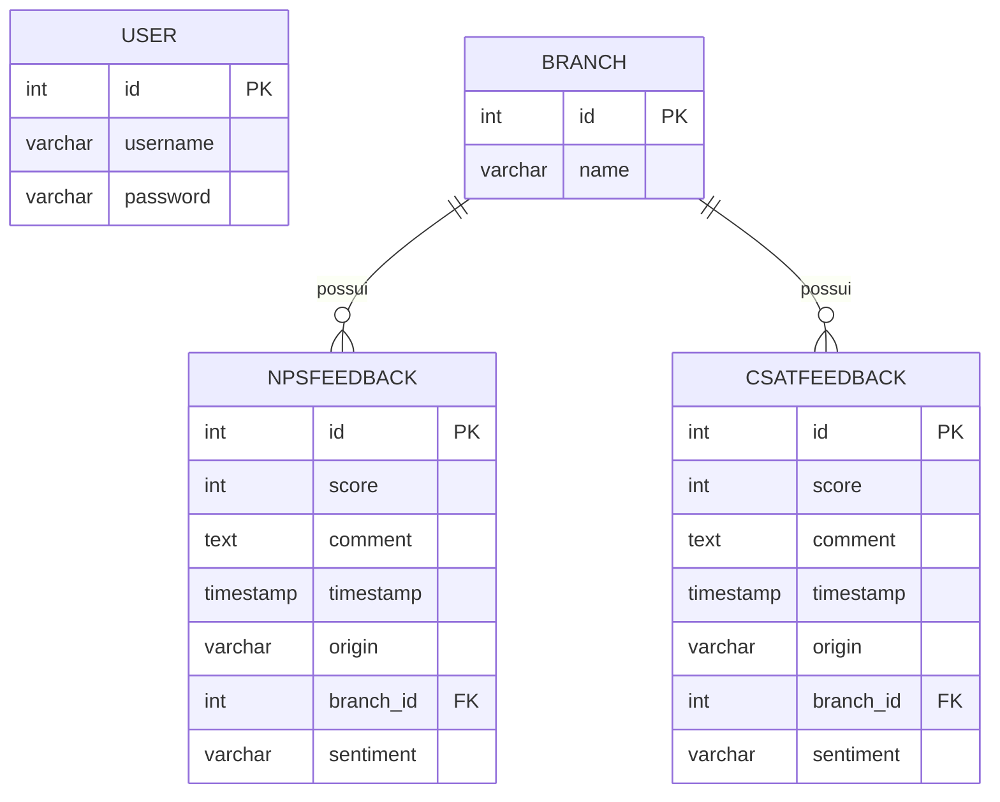
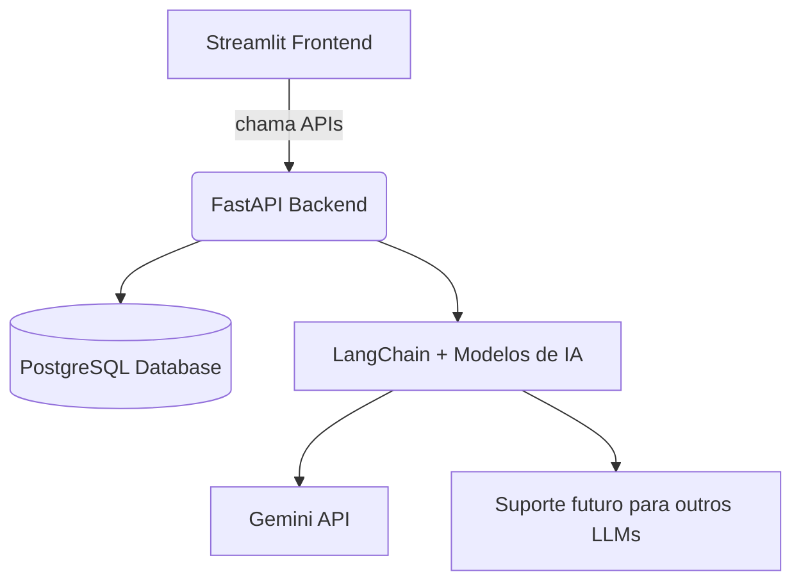

# 📊 Dashboard de Feedback — NPS & CSAT

Este projeto foi desenvolvido **100% em Python**, com o objetivo de analisar a experiência de usuários através de métricas de satisfação (NPS e CSAT).
Ele combina **visualizações interativas**, **inteligência artificial** e uma arquitetura modular para facilitar a evolução do sistema.


[](https://www.python.org/)
[](https://streamlit.io/)
[](https://fastapi.tiangolo.com/)
[](https://www.postgresql.org/)
[](https://www.langchain.com/)
[](https://www.docker.com/)
[](https://docs.pytest.org/en/stable/)


---

## 🎯 Objetivo do Projeto

O objetivo deste projeto é **analisar a experiência do usuário** por meio de métricas de satisfação, permitindo que a equipe tome decisões baseadas em dados para melhorar continuamente os serviços.

Além dos gráficos e relatórios, o dashboard também apresenta:

* **Resumos dinâmicos** gerados com IA.
* Classificação dos comentários por **análise de sentimentos**.

---

## 📊 Métricas utilizadas

* **NPS (Net Promoter Score):** mede a probabilidade de recomendação do serviço/produto por parte dos usuários (escala 0 a 10).
* **CSAT (Customer Satisfaction):** avalia o nível de satisfação imediata em relação a uma experiência específica (escala 1 a 5).

---

## 🗄️ Geração da Massa de Dados

Os dados são **gerados com inteligência artificial** para fins de teste e desenvolvimento.

Cada feedback contém:

* Nota (NPS ou CSAT)
* Comentário coerente com a nota
* Data de envio
* Origem (Site, App, Telefone, Email, Chat ou Presencial)
* Sentimento detectado (Positivo, Negativo ou Neutro)

⚡ **Melhoria futura:** os serviços que geram e categorizam os dados poderão rodar em **workers separados**, para evitar sobrecarga do backend.

---


## 👨‍💻 Arquitetura do Projeto

Este projeto utiliza as seguintes tecnologias:

* **Frontend:** [Streamlit](https://streamlit.io/)
* **Backend:** [FastAPI](https://fastapi.tiangolo.com/)
* **Banco de dados:** [PostgreSQL](https://www.postgresql.org/)
* **IA:** [LangChain](https://www.langchain.com/) + **Gemini** (suporte inicial, mas com arquitetura pronta para outros LLMs)
* **Testes:** [pytest](https://docs.pytest.org/)

### 📦 Estrutura do Banco de Dados



> **Nota:** NPS e CSAT foram mantidos em tabelas **separadas** para facilitar buscas, extensões futuras e escalabilidade.

### 🏗️ Arquitetura Geral



Além das rotas expostas pela API, o baceknd também possui dois processos que rodam em segundo plano de forma continua utilizando CronJobs:

* **Categorização de comentários**: busca comentários ainda não categorizados em NPS e CSAT e classifica-os com base em sentimentos.
* **Geração de dados**: gera dados fictícios para testes e desenvolvimento.

---

## 🧪 Testes

* O backend possui testes unitários escritos em **pytest**, garantindo confiabilidade da lógica e das APIs.

---

## 📂 Estrutura do Projeto

* A pasta **frontend/** contém o código do Streamlit (componentes, páginas e layouts).
* A pasta **backend/** contém o FastAPI, serviços de IA e integração com o banco.
* A explicação detalhada da estrutura está em cada subpasta.

---

## 🚀 Como rodar o projeto

O projeto pode ser executado com **Docker** utilizando docker:

```bash
docker compose up --build
```

Na raiz do projeto existe um arquivo `.env.example`.
Antes de rodar o projeto você deve copiá-lo para `.env` e ajustar os valores conforme sua necessidade:

```bash
cp .env.example .env
```


Após iniciar o projeto, acesse o **dashboard** em `http://localhost:8500` utilizando o usuário `admin` e a senha `admin`.

O Arquivo OpenAPI para chamadas do backend estará disponível em `http://localhost:8000/docs`.

Para rodar localmente, veja as instruções específicas em:

* [frontend/README.md](frontend/README.md)
* [backend/README.md](backend/README.md)

---

## 📌 Melhorias para o futuro

* [ ] Separar workers de geração e categorização de dados.
* [ ] Adicionar suporte a outros LLMs além do Gemini.
* [ ] Persistência da sessão dos usuários.
* [ ] Refinar dashboards com mais filtros e métricas.
